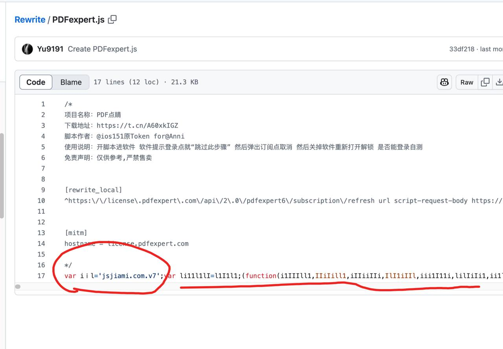
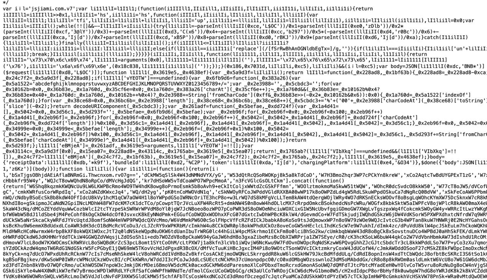

## 使用

1. 安装 Node.js 环境 ——> [Node.js](https://nodejs.org/zh-cn/download/prebuilt-installer)
  
2. 终端执行:
           安装依赖  ——> npm i

   cd js

   node src/main.js -t sojsonv7 -i input.js -o output.js

‘type’ ——> sojsonv7
👇
* common (高频局部的混淆)
* jjencode  (sojson.com 版本)
* sojson  （jsjiami.v6 版本）
* sojsonv7 （jsjiami.v7 版本）
* obfuscator  （市面上通用加密）

注意:
* 文件中不能包含除混淆代码以外的内容（非混淆代码）
* 默认输出 ——> 文件为`output.js`

## 图示

jsjiami.com.v7 版本  👉  https://raw.githubusercontent.com/Yu9191/Rewrite/refs/heads/main/PDFexpert.js

👇

👇

