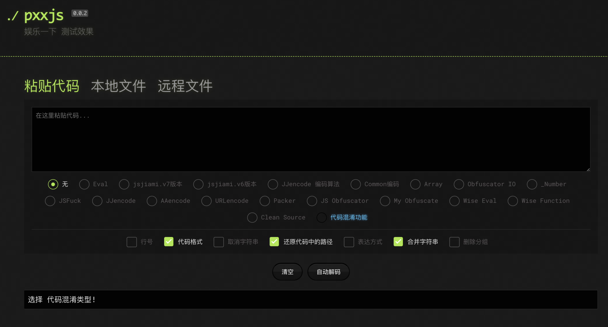
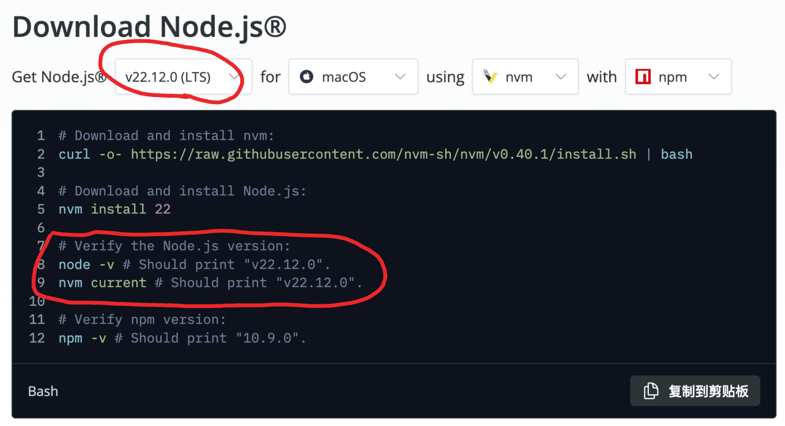

<details>
<summary> <-- https://pxx917144686.github.io/pxxjs</summary>

[](https://pxx917144686.github.io/pxxjs/)
</details> 


## 首先需要了解的问题：  这段代码属于  解混淆？ 解密？

## 解混淆
   目的：将混淆后的代码或程序转换回更易读、易理解的形式  ——> 便分析代码逻辑
<details>
<summary>解混淆 方法</summary>

静态分析：分析代码结构、控制流、数据流; 
 
代码模式识别：识别混淆模式，如无意义的变量名、冗余代码; 
 
变量和函数重命名：为混淆的变量和函数赋予有意义的名称; 
 
控制流还原：简化和重构复杂的控制流结构;
</details>

## 解密
   目的：将加密的数据还原为其原始的、可读的形式   ——> 用于保护数据安全，确保只有授权人员能够访问
<details>
<summary>解密 方法</summary>

使用密钥：对于对称加密，使用相同的密钥进行解密；对于非对称加密，使用对应的私钥进行解密；

算法逆过程：应用加密算法的逆过程，如AES、RSA
</details>
<details>
<summary>解密 举例</summary>

Base64编码的数据 ——> var _0x152e = "akx0VmY=", "YnJlYWs=", ...

字符串编码 ——> 代码中有大量看似随机的字符串，如"akx0VmY="、"YnJlYWs="等。这些字符串可能是经过Base64等编码方式加密的数据

动态代码执行 ——> Function、eval 使得代码的真实意图更难被直接看懂

变量函数命名 ——> _0x152e、_0x27328c

</details>

## 使用

安装 Node.js 环境 ——> 官方版本  [Node.js](https://nodejs.org/zh-cn/download/prebuilt-installer)

## 推荐版本——>v22.12.0 (LTS)
<details>
<summary>Node.js 是一个开源的、跨平台的 JavaScript 运行时环境</summary>
Node.js 是一个开源的、跨平台的 JavaScript 运行时环境，允许开发者使用 JavaScript 在服务器端运行代码，从而构建各种网络应用，如网站、API、实时聊天应用等。它基于 Chrome 的 V8 引擎，具有高性能和高效的事件驱动架构，非常适合构建可扩展的网络应用。

LTS 是 Long Term Support（长期支持）的缩写。在 Node.js 的版本发布周期中，LTS 版本指的是那些经过充分测试、稳定且适合用于生产环境的版本。这些版本会在较长的时间内（通常是 30 个月）获得官方的维护和支持

大多数教程和学习资料都是基于 LTS 版本编写的


</details>   

### 下载链接 [js-main.zip](https://github.com/pxx917144686/js/archive/refs/heads/main.zip)
### 解压 `js-main.zip`
## 终端执行：
   cd js文件夹
```bash
cd js.main
```

  安装依赖  ——> 
```bash
npm i
```
  解码 ——>
```bash
node src/main.js -t sojsonv7 -i input.js -o output.js
```

## 使用 例子
```bash
node src/main.js -t sojsonv7 -i /Users/pxx917144686/Downloads/result.js -o output.js
```

node src/main.js -t sojsonv7 -i     #使用node（Node.js 环境）执行——>src/main.js -t sojsonv7

/Users/pxx917144686/Downloads/result.js   #需要解密的那个文件  可以直接拖入终端

-o output.js     #解密成功生成文件output.js 默认在脚本文件夹内

<details>
<summary>关于 ——> sojsonv7   可以替换</summary>

👇
* common (高频局部的混淆)
* jjencode  (sojson.com 版本)
* sojson  （jsjiami.v6 版本）
* sojsonv7 （jsjiami.v7 版本）
* obfuscator  （市面上通用加密）
</details> 

<details>
<summary>点击 ——> 提醒注意</summary>
注意:

* 文件中不能包含除混淆代码以外的内容（非混淆代码）

* 默认输出 ——> 文件为`output.js`
</details> 

<details>
<summary>jsjiami.v7 截图</summary>

jsjiami.com.v7 版本  👉  https://raw.githubusercontent.com/Yu9191/Rewrite/refs/heads/main/PDFexpert.js


👇


👇


</details> 
